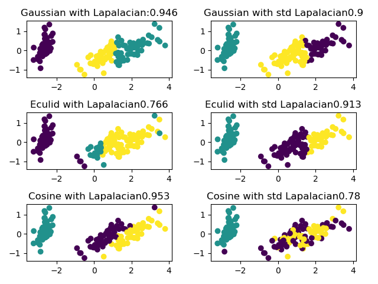

# Spectral Clustering

## 1. 如何运行
---
#### 1.1 开发环境
Python3.7

Lib: numpy, matplotlib, sklearn(用于kmeans对比)

#### 1.2 运行
位于文件夹根目录下：

`python main.py`

程序将会运行不同模型，显示结果的对比

#### 1.3 运行结果

程序运行后，会依次显示三张图片，分别是

* 利用高斯核函数在不同参数下，谱聚类的结果


* 不同相似度矩阵计算方法下，谱聚类的结果


* 实现的k-means与sklearn库中对比


## 2. 项目结构
---

```

│─main.py       //主函数，调用src/test中方法测试并绘图
│─README.md
│
├─data
│      iris.data
│
├─img
│      gaussian_result.png
│      kmeans_result.png
│      spectral_result.png
│
├─src
   │  kmeans.py         //实现kmeans
   │  model.py          //谱聚类实现
   │  test.py           //调用model中方法测试并绘图
   │  util.py           //读取data，计算聚类后准确率
   │
   └─__pycache__

```